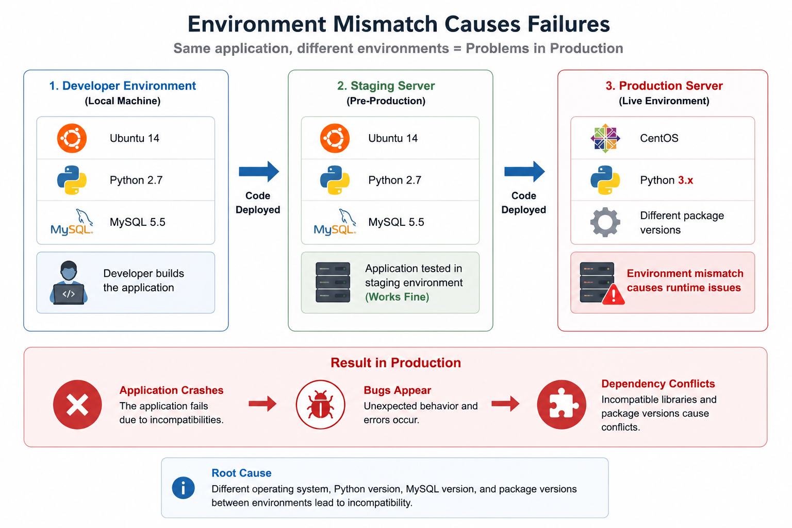

# Before Docker

## 1. Problem : "Works on my machine"

## 2. Environment Inconsistency as Developers used different machines:

- Windows
- Linux
- Mac
- Different Library Version
- Different runtime Version
- Different configurations

### For example:

A developer builds an application on the following:
(Dev Environment)
Ubuntu 14
Python 2.7
MySQL 5.5

The staging server also runs on:
(QA Engineers/ Devs: Final technical smoke test)
Ubuntu 14
Python 2.7
MySQL 5.5

But the production server runs.
(Real customers/ Public)
CentOS
Python 3.x
Different package versions

Result:
Application crashes
Bugs appear.
Dependency conflicts happen.

---
