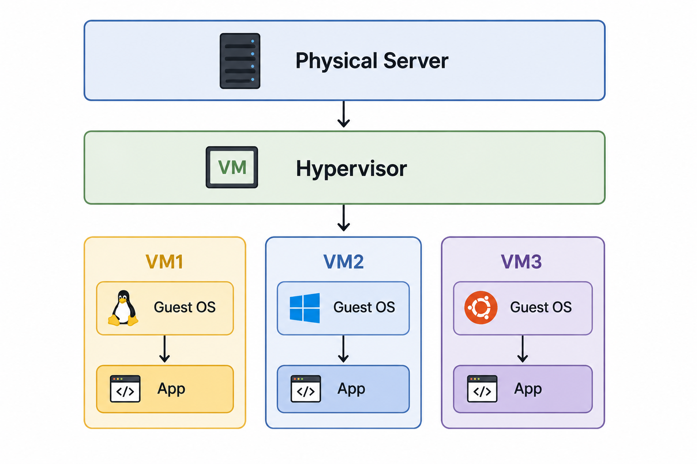

# Before Docker

## 1. Problem : "Works on my machine"

## 2. Environment Inconsistency as Developers used different machines:

- Windows
- Linux
- Mac
- Different Library Version
- Different runtime Version
- Different configurations

### For example:

A `developer` builds an application on the following:
`(Dev Environment)`

- Ubuntu 14
- Python 2.7
- MySQL 5.5

The `staging server` also runs on:
`(QA Engineers/ Devs: Final technical smoke test)`

- Ubuntu 14
- Python 2.7
- MySQL 5.5

However, on the `production server` runs.
`(Real customers/ Public)`:

- CentOS
- Python 3.x
- Different package versions

`Final Result:`

- Application crashes
- Bugs appear.
- Dependency conflicts happen.

## 3. The second problem is Heavy Virtual Machines (VM Era)

### Before containers became mainstream, companies mostly used Virtual Machines.

#### Each VM had:

- Full operating system.
- Separate Kernel.
- Separate Libraries.
- Separate Boot process.

#### Actual Big problem:

- Very slow performance.
- Huge RAM Consumptions.
- Large Storage Size (GBs).
- Poor Scalability.

Example: Running 20 VMs required huge infrastructure.

## 4. Deployment was painful (Manual Processes)

- Install Java
- Install dependencies
- Configure paths
- Install libraries
- Set environment variables
- Fix permissions
- Pray everything works

## 5. Scaling was difficult

Suppose traffic suddenly increased.

#### To scale:

- Create new VM
- Install OS
- Install dependencies
- Configure app
- Test again

This process could take:

- Hours
- Sometimes days

Modern containers start in: Seconds

## 6. Poor Resource Utilization

VMs wasted resources because every VM carried:

- Entire OS
- Background services
- Kernel overhead

Companies were paying for:

- More servers
- More RAM
- More CPUs
  just to run isolated applications.

---

# Did Container Technology Exist Before Docker?

### YES — absolutely.

### Docker did NOT invent containers.

### This is one of the most important things to understand.

# Container Technologies Before Docker

| Technology             | Company / Creator | Year |
| ---------------------- | ----------------- | ---- |
| chroot                 | Unix              | 1979 |
| FreeBSD Jails          | FreeBSD           | 2000 |
| Solaris Zones          | Sun Microsystems  | 2004 |
| Linux Containers (LXC) | Linux community   | 2008 |
| OpenVZ                 | Open-source       | 2005 |

## These technologies already provided:

- Process isolation
- Filesystem isolation
- Resource control

which are the foundation of containers.

---

### Why Older Container Technologies Failed to Become Mainstream

| Problem                     | Explanation                       |
| --------------------------- | --------------------------------- |
| Complex setup               | LXC required deep Linux knowledge |
| No easy packaging           | No standard image format          |
| No developer experience     | Difficult commands and workflows  |
| Weak ecosystem              | No centralized image sharing      |
| No portability standard     | Moving apps was difficult         |
| Poor tooling                | No smooth CI/CD integration       |
| Limited documentation       | Mostly Linux-admin focused        |
| Not cross-platform friendly | Mostly Linux-only mindset         |

---

## Then What Did Docker Do Differently?

- This is where Docker changed the entire industry.
- Docker’s genius was NOT inventing containers.

### Docker’s genius was:

“Making containers simple, portable, and developer-friendly.”

---

# The Biggest Innovations Docker Brought

### 1. Simple Developer Experience

Docker commands were easy:
`docker build` \
`docker run` \
`docker pull` \  
`docker push` \

Instead of low-level Linux namespace management.
This changed everything.

### 2. Dockerfile (Revolutionary Idea)

Dockerfile: \
`FROM ubuntu` \
`RUN apt install nginx` \
`COPY . /app` \
`CMD ["python", "app.py"]` \

Now infrastructure became:

- “Infrastructure as Code”

#### Huge breakthrough.

### 3. Portable Images

Docker created standard portable images.

You could:

- Build once
- Run anywhere

#### This became the industry slogan: “Build Once, Run Anywhere”

### 4. Docker Hub (Massive Success Factor)

which became:
GitHub for container images
Now developers could instantly pull:

- Nginx
- Redis
- MySQL
- Ubuntu
- Node.js
  with one command.
  This accelerated adoption enormously.

### 5. Standardization

Docker standardized:

- Image format
- Build process
- Container lifecycle
- Registry system

Before Docker: Everyone did containers differently.
After Docker: Industry adopted common standards.

### 6. Perfect Timing (Cloud + DevOps Era)

Docker arrived exactly when:

- Cloud computing was exploding
- Microservices were rising
- DevOps culture was growing
- CI/CD pipelines were becoming important

Docker fit perfectly into this transformation.
Timing matters massively in technology success.

### 7. Ecosystem Explosion

Docker became easy to integrate with:

- CI/CD
- Kubernetes
- Cloud providers (AWS,GCP,Azure etc.)
- DevOps tooling

---

# Final Industry-Level Summary

| Before Docker            | After Docker               |
| ------------------------ | -------------------------- |
| Heavy VMs                | Lightweight containers     |
| Manual deployments       | Automated deployments      |
| Environment mismatch     | Consistent environments    |
| Complex infra setup      | Infrastructure as Code     |
| Slow scaling             | Fast scaling               |
| Dependency conflicts     | Isolated dependencies      |
| Sysadmin-focused tooling | Developer-friendly tooling |
| No ecosystem             | Massive ecosystem          |

### Docker changed the entire cloud-native industry architecture permanently.
