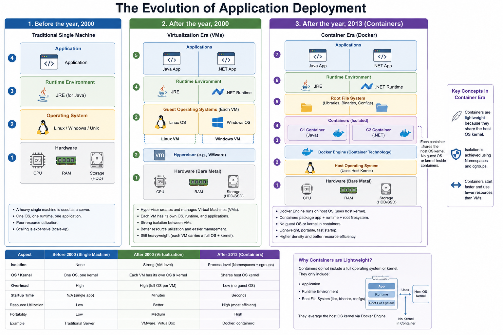

| Aspect                   | Docker as a Technology                                                                                            | Docker as a Company                                                                                                                                                                                                                                                                                         |
| ------------------------ | ----------------------------------------------------------------------------------------------------------------- | ----------------------------------------------------------------------------------------------------------------------------------------------------------------------------------------------------------------------------------------------------------------------------------------------------------- |
| Definition               | A containerization platform and ecosystem used to build, package, ship, and run applications in containers.       | The organization that created and commercialized Docker technologies and products.                                                                                                                                                                                                                          |
| Main Purpose             | Solve software portability, dependency management, and environment consistency problems.                          | Develop tools, services, and business products around container technology.                                                                                                                                                                                                                                 |
| What It Includes         | Docker Engine, Docker CLI, Dockerfile, Docker Compose, Docker Images, Docker Containers, Docker Hub, etc.         | Business operations, product development, partnerships, subscriptions, enterprise offerings, support, and community management.                                                                                                                                                                             |
| Nature                   | Open-source technology ecosystem.                                                                                 | Commercial company.                                                                                                                                                                                                                                                                                         |
| Core Function            | Runs applications in isolated containers using OS-level virtualization.                                           | Builds and maintains Docker-related products and services.                                                                                                                                                                                                                                                  |
| Users                    | Developers, DevOps engineers, SREs, Platform engineers, Cloud engineers.                                          | Customers, enterprises, developers, investors, partners.                                                                                                                                                                                                                                                    |
| Licensing                | Many components are open source (Apache 2.0 or similar). Some desktop/business features have commercial licenses. | Operates under business licensing and subscription models.                                                                                                                                                                                                                                                  |
| Popular Components       | Docker Engine, Docker Desktop, Docker Compose, Docker Swarm, Docker Hub.                                          | Docker Desktop subscriptions, enterprise support, Docker Hub services, developer tools.                                                                                                                                                                                                                     |
| Relation to Containers   | Docker popularized modern containers and simplified their adoption.                                               | The company helped make containers mainstream through tooling and ecosystem growth.                                                                                                                                                                                                                         |
| Dependency on Each Other | The technology can continue evolving through open-source communities even beyond the company itself.              | The company depends on the popularity and adoption of Docker technology.                                                                                                                                                                                                                                    |
| Example Statement        | “I am using Docker to containerize my Node.js application.”                                                       | “Docker Inc. released new pricing plans for Docker Desktop.”                                                                                                                                                                                                                                                |
| Competitors              | Kubernetes container runtimes, Podman, containerd, CRI-O, LXC.                                                    | Companies like [Red Hat](https://www.redhat.com?utm_source=chatgpt.com), [VMware](https://www.vmware.com?utm_source=chatgpt.com), [Mirantis](https://www.mirantis.com?utm_source=chatgpt.com), and [HashiCorp](https://www.hashicorp.com?utm_source=chatgpt.com) in parts of the container/cloud ecosystem. |
| Ownership                | No single owner controls the entire container ecosystem anymore.                                                  | A private company managing its own products and business strategy.                                                                                                                                                                                                                                          |
| Industry Impact          | Revolutionized DevOps, CI/CD, cloud-native development, and microservices adoption.                               | Commercialized and expanded the ecosystem around container technology.                                                                                                                                                                                                                                      |
| Real-World Analogy       | Docker technology is like the “shipping container system” used worldwide for transporting goods consistently.     | Docker Inc. is like the “company that designed and sells tools/services around that shipping container system.”                                                                                                                                                                                             |

Simple One-Line Summary

- Docker technology = the actual container platform and tools.
- Docker Inc. = the company behind many Docker products and services.

Easy Mental Model:
| Example | Technology | Company |
| ---------- | -------------------- | ---------------------------------------------------------------------------------------------- |
| Android | Android OS | [Google](https://www.google.com?utm_source=chatgpt.com) |
| Kubernetes | Kubernetes platform | [Google Cloud](https://cloud.google.com?utm_source=chatgpt.com) originally contributed heavily |
| Git | Git version control | [GitHub](https://github.com?utm_source=chatgpt.com) is a company using/supporting Git services |
| Docker | Container technology | [Docker Inc.](https://www.docker.com?utm_source=chatgpt.com) |

---

# The Evolution:

### 1. Before the year, 2000

- The heavy single machine is used as a server.
- The first layer is hardware (CPU, RAM, and storage (HDD)).
- The second layer, upon the first layer, is the operating system.
- Third layer, upon second layer, application run time environment, for example, Java must have JRE runtime environment.
- Fourth layer, the application resides on top of the layer.

### 2. After the year, 2000

- The first layer is hardware, or bare metal hardware is used.
- The second layer, upon first layer, has Hypervisor software installed, such as VMWare.
- The third layer, upon the second layer, has different operating system layers installed, such as Linux, Windows, etc.
- The fourth layer, upon the third layer, has a runtime environment installed as per the application requirement. For example, Linux os has JRE for Java applications.
  And Windows os has a .NET runtime for .net applications.
- The topmost layer, the final layer upon the fourth layer, has applications residing on each operating system with respective runtime environments.
- Each operating system isolation is called a virtual machine, i.e., a Linux VM machine and a Windows VM machine.

### 3. After the year, 2013

- The first layer is hardware layer.
- The second layer, upon the first layer, is an operating system layer.
- The third layer, upon the second layer, is Docker Engine (container technology) instead of a hypervisor.
- The fourth layer, upon third layer, is Container (running container, lightweight)
- The fifth layer, upon the fourth layer, which is very important, is the "root file system"—a collection of libraries, binaries, and configurations.
- The sixth layer, upon the fifth layer, is the runtime environment layer for Java; we use JRE, and for .NET we use the .NET runtime environment, etc., etc.
- The final layer, upon the sixth layer, is the application layer where the application will run.
- Here, the hardware to Docker engine layer is called the host, and above that there is a separation of containers. Like a C1 container for Java and a C2 container for a .NET application.
- The big thing here is that containers use the KERNEL of the host machine's operating system and communicate with the hardware of the host machine. As we know, a container does not have a full operating system installed, and containers also do not carry any KERNEL with them; they have root file system. That is why the containers are light weight processes, isolated on the basis of Namespaces and control groups (cgroups).

